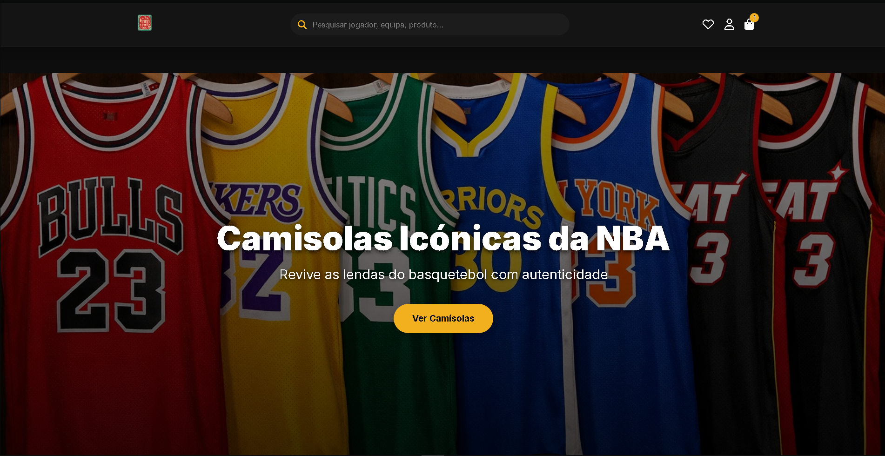
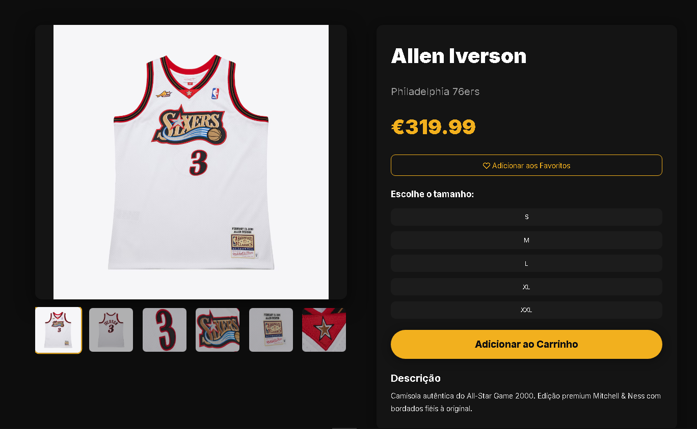
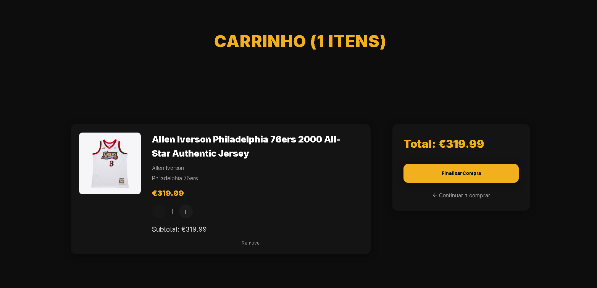

# 🏀 HOOP

> **Basketball, culture and e-commerce in one digital experience.**

[](https://hoop-16alves02.netlify.app)
[](https://react.dev/)
[](https://www.typescriptlang.org/)
[](https://vite.dev/)
[](LICENSE)

> ⚠️ **Academic project:** HOOP is a fictional e-commerce experience. It does not represent a real store, process real purchases or have a commercial relationship with the brands and products represented in the interface.

## 🌐 Live Demo

**[Open HOOP](https://hoop-16alves02.netlify.app)**

## 📌 What Is HOOP?

**HOOP** is a basketball-focused e-commerce web application built to simulate the experience of browsing, discovering and purchasing basketball products.

The project combines a strong sports identity with a complete frontend shopping flow, from the homepage and product discovery to product details, favourites, cart, account screens and a simulated checkout.

The first versions were developed in **December 2025** and the project continued to evolve significantly in **2026**.

## 🏀 The Experience

The interface is organised around a basketball-oriented catalogue with products such as:

- Basketball jerseys
- Basketball shoes
- Balls
- Accessories
- Basketball lifestyle products

The catalogue includes data such as brand, player, team, gender, size, colour, price, description and optional reviews, depending on the product.

The repository contains product imagery organised by brands and categories, together with dedicated hero imagery and screenshots for the interface.

## 🛍️ Store Features

### 🏠 Homepage

The homepage includes:

- Rotating hero slides
- Calls to action for jerseys, shoes and the full catalogue
- Featured products
- A promotional section
- Responsive presentation

### 🔎 Product Discovery

Users can browse the full collection and search for products using:

- Product name
- Player
- Team

The collection page supports filters for:

- Product type
- Gender
- Size
- Price
- Brand
- Team
- Player
- Colour
- New products
- Promotions

Results can also be sorted by:

- Price, ascending
- Price, descending
- Name
- Newest

The product catalogue uses pagination and keeps filter state in the URL.

### 🏷️ Product Details

Individual product pages provide:

- Product gallery
- Product information
- Player and team information where available
- Price
- Size selection where applicable
- Favourite action
- Add to cart
- Description
- Product reviews
- Review submission interface

### ❤️ Favourites

The favourites system allows users to save products and access them later.

Favourite data is persisted locally in the browser.

### 🛒 Shopping Cart

The cart supports:

- Adding products
- Selecting sizes where applicable
- Changing quantities
- Removing products
- Calculating the cart total
- Clearing the cart

Cart data is persisted with `localStorage`.

### 👤 Account Experience

HOOP includes simulated account functionality with:

- Login
- Registration
- Profile
- Session persistence

The authentication layer is **local and simulated**. It does not connect to a real authentication provider or backend.

### 💳 Simulated Checkout

The checkout is divided into multiple steps:

```text
Login
  ↓
Delivery
  ↓
Payment
  ↓
Success
```

The interface includes simulated options for:

- Card
- MB WAY
- Multibanco
- PayPal
- Apple Pay
- Google Pay

The card form includes client-side validation and card-brand detection. Multibanco generates a simulated payment reference.

No real payment is processed.

## 📄 Supporting Pages

The project also includes dedicated pages for:

- About
- Contact
- FAQ
- Buying Guide
- Size Guide
- Terms and Conditions
- Privacy Policy
- Legal information
- Login
- Registration
- Profile

## 🎨 Visual Identity

HOOP was designed around a premium basketball-store aesthetic:

| Element | Direction |
| --- | --- |
| Background | Dark / near-black |
| Primary accent | HOOP yellow |
| Cards | Dark grey |
| Typography | High-contrast light text |
| Imagery | Basketball-focused product and editorial imagery |

The interface uses a responsive layout and a component-based React architecture to keep the visual system consistent across the application.

## 🧱 Architecture

```text
src/
├── components/
├── context/
│   ├── AuthContext
│   ├── CarrinhoContext
│   ├── FavoritosContext
│   └── ToastContext
├── data/
│   ├── produtos.json
│   └── produtos.ts
├── pages/
│   ├── Home
│   ├── Produtos
│   ├── Pesquisa
│   ├── ProdutoDetalhes
│   ├── Carrinho
│   ├── Favoritos
│   ├── Checkout
│   └── Institutional pages
├── styles/
├── Layout.tsx
└── main.tsx
```

The application separates:

- Pages
- Reusable components
- Global application contexts
- Product data
- Styling
- Routing and layout

### State Management

React Context is used for the main application state:

- Authentication
- Cart
- Favourites
- Toast notifications

Local storage provides persistence for the client-side simulation.

## 🛠️ Tech Stack

### Core

- React 19
- TypeScript
- Vite

### Application

- React Router DOM
- React Context API
- React Icons

### Supporting tools

- ESLint
- Node.js
- npm

The repository also contains a product-generation script used to work with the product image catalogue.

## 🚀 Getting Started

### Requirements

- Node.js
- npm

### Clone

```bash
git clone https://github.com/16alves02/hoop.git
cd hoop
npm install
```

### Development

```bash
npm run dev
```

### Build

```bash
npm run build
```

### Preview production build

```bash
npm run preview
```

### Lint

```bash
npm run lint
```

## 📸 Screenshots

### Home



### Product



### Cart



## 🗓️ Project History

- **December 2025** - First HOOP Store versions committed.
- **January 2026** - Major development phase, including routing, TypeScript fixes, project structure and store functionality.
- **2026** - Continued work on product data, screenshots, documentation and presentation.
- **2026** - README and copyright information refreshed.

## 👤 Author

**Leonardo Alves - [@16alves02](https://github.com/16alves02)**

HOOP is part of the **16alves02** project portfolio.

## 📜 License & Copyright

**Copyright (c) 2025-2026 Leonardo Alves (16alves02). All rights reserved.**

This project is **not open source**. The source code is published for viewing and educational reference, but it may not be copied, redistributed, modified for public or commercial use, sublicensed, sold, or presented as someone else's work without prior written permission.

See the [LICENSE](./LICENSE) file for the full terms.
