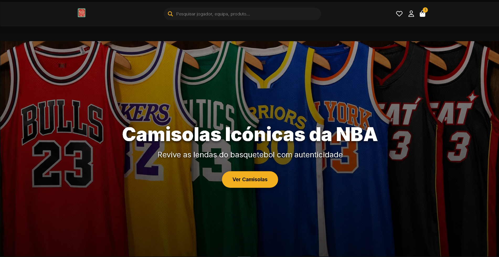
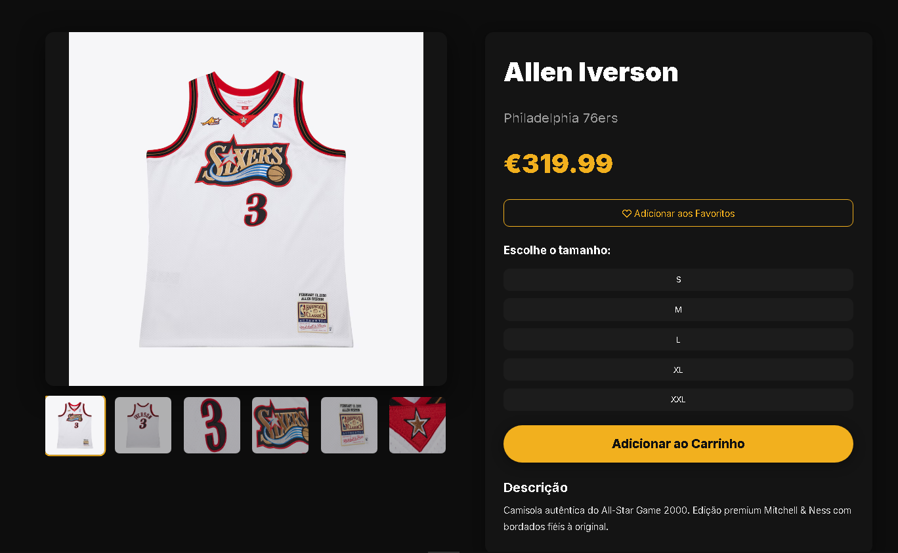
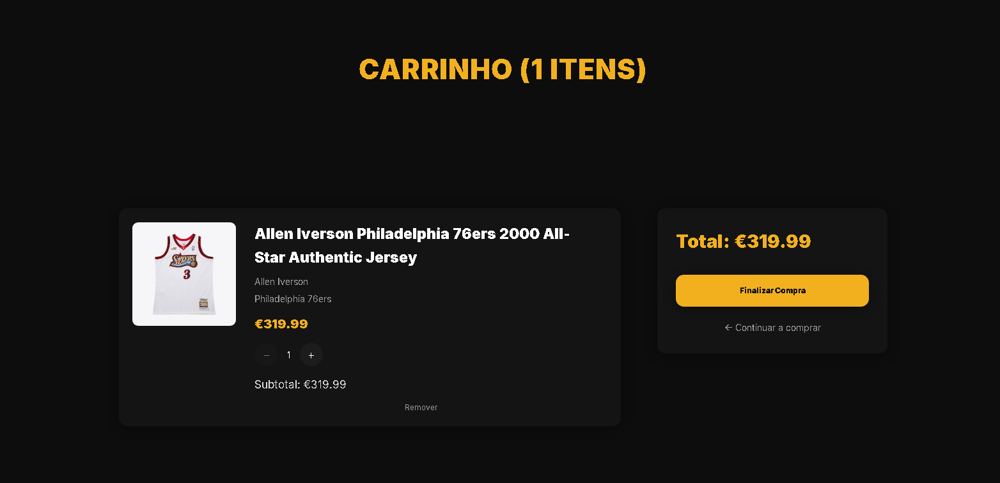

# 🏀 HOOP — Basketball E-Commerce  
### Projeto Académico

Bem-vindo à **HOOP**, uma plataforma fictícia de e-commerce dedicada ao basquetebol.  
Este projeto foi desenvolvido com foco em **experiência de utilizador**, **identidade visual forte**, **organização modular** e **simulação realista** de uma loja online moderna.

> ⚠️ **Nota importante**  
> Este website é **100% académico**.  
> Não representa uma loja real, não realiza vendas e não possui qualquer ligação comercial com marcas mencionadas.
> https://hoop-16alves02.netlify.app

---

## 🚀 Tecnologias Utilizadas
- **React + TypeScript**
- **Vite**
- **React Router DOM**
- **Context API**
  - Carrinho
  - Favoritos
  - Autenticação
  - Toasts
- **CSS modular e responsivo**
- **Font Awesome**
- **LocalStorage** (simulação de carrinho, favoritos e sessão)

---

## 🧱 Arquitetura do Projeto
```text
src/
 ├── components/
 ├── context/
 ├── data/
 ├── pages/
 ├── styles/
 ├── Layout.tsx
 ├── main.tsx
 └── App.tsx (não utilizado — rotas definidas no main)
````

### Estrutura

* Layout global com **Header**, **Footer** e **Outlet**
* Páginas independentes e bem organizadas
* Contextos separados por responsabilidade
* Produtos mockados em `data/produtos.ts`

---

## 🎨 Design System — HOOP

A identidade visual segue uma linha **premium**, **escura** e de **alto contraste**, inspirada em arenas de basquetebol.

### 🎨 Paleta de Cores

| Elemento                    | Cor       |
| --------------------------- | --------- |
| Cor principal (HOOP Yellow) | `#f2b01e` |
| Fundo                       | `#0d0d0d` |
| Cartões / Caixas            | `#181818` |
| Inputs                      | `#222`    |
| Texto principal             | `#eeeeee` |
| Texto secundário            | `#aaaaaa` |
| Texto terciário             | `#777777` |

### 🧩 Princípios de UI

* Amarelo HOOP usado apenas em botões, links e hovers
* Fundo escuro para uma estética premium
* Cards em cinza escuro para contraste suave
* Tipografia clara para leitura confortável

---

## 📦 Funcionalidades

### 🛒 Carrinho de Compras

* Adicionar e remover produtos
* Gestão de quantidades
* Persistência via `localStorage`

### ❤️ Favoritos

* Guardar produtos
* Badge com contagem
* Persistência local

### 🔍 Pesquisa

* Pesquisa por nome, jogador ou equipa
* Página dedicada a resultados

### 🏷️ Filtros Avançados

* Tipo
* Género
* Tamanho
* Marca
* Equipa
* Jogador
* Cor
* Preço
* Novidades / Promoções
* Ordenação

### 👤 Autenticação (simulada)

* Login
* Registo
* Perfil
* Sessão guardada localmente

### 💳 Checkout (simulado)

* Login
* Morada de entrega
* Pagamento
* Página de sucesso

### 📄 Páginas Institucionais

* Sobre
* Contacto
* FAQ
* Termos e Condições
* Política de Privacidade
* Guia de Compra
* Guia de Tamanhos
* Informação Legal

---

## 🗺️ Roadmap

### ✅ Concluído

* Estrutura completa da loja
* Carrinho e favoritos com persistência
* Autenticação simulada
* Checkout completo
* Filtros avançados e ordenação
* Pesquisa dinâmica
* Layout responsivo
* Design System HOOP
* Páginas institucionais

### 🚧 Em Desenvolvimento

* Acessibilidade (ARIA, navegação por teclado)
* Animações premium (transições e micro-interações)
* Lazy loading e otimizações de performance
* SEO e metadados melhorados

### 🔮 Planeado

* Sistema de reviews (simulado)
* Histórico de encomendas (simulado)
* Página “A Nossa História”
* Sugestões inteligentes de produtos
* Modo **Arena Dark+**
* Internacionalização (PT / EN)

---

## 🗂️ Scripts Disponíveis

```bash
npm install
npm run dev
npm run build
npm run preview
```

---

## 🧪 Como correr o projeto localmente

```bash
git clone https://github.com/16alves02/hoop.git
cd hoop
npm install
npm run dev
```

---

## 📸 Screenshots





---

## 🔒 Licença e Uso

Este projeto utiliza a **Licença MIT**, com a seguinte nota adicional:

> Este projeto é **exclusivamente académico**.
> Não deve ser utilizado para fins comerciais, redistribuição ou implementação real.
> Todo o conteúdo (produtos, imagens, textos e marcas) é fictício ou usado apenas para fins educativos.

---

## 👨‍💻 Autor

**Leonardo Alves**
GitHub: [https://github.com/16alves02](https://github.com/16alves02)

Projeto desenvolvido com paixão pelo basquetebol e pela web 🏀💻
